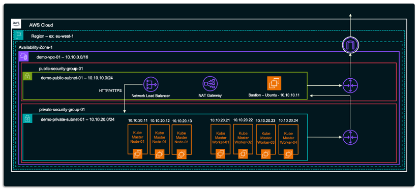

# 01-Provision

> *Automatically provision infrastructure on AWS that is suitable for building a Kubernetes cluster. Provisioning is done using a Terraform script — it builds empty VMs, fully networked and ready for Kubernetes to be installed by the next part of this repo.*

---

## Description

As explained in the main [**README**](/README.md) of this repo, **Kubernetes-Hands-On-Demo-On-AWS** is built to walk you through Kubernetes step by step, through hands-on demo activities. Those demo activities need a working Kubernetes cluster to run on, and a cluster needs infrastructure underneath it — networking, security, and virtual machines. Building that infrastructure by hand, every time, takes time and effort that gets in the way of the actual learning. This repo fixes that: it automates provisioning so the infrastructure is ready fast and you can get straight to learning Kubernetes. So this repo splits the work into three folders, each handling one stage:

1. **01-Provision** (this folder) — builds the AWS infrastructure the cluster will run on.
2. [**02-Prepare**](/02-Prepare/README.md) — installs, configures, and prepares Kubernetes on that infrastructure.
3. [**03-Hands-On-Demo**](/03-Hands-On-Demo/README.md) — the working cluster is used for hands-on Kubernetes exercises.

This folder covers the first stage. Its job is to automatically provision, **on AWS**, an infrastructure that is ready for a Kubernetes cluster to be built on top of it. This is done using a Terraform script. Running it gives you a VPC, public and private subnets, a load balancer, security groups, and a set of virtual machines: one bastion host, and one or more master and worker nodes, all wired together and reachable.

It's worth being clear about what this step does **not** do. It does not install Kubernetes. What you get at the end of this step is a set of empty virtual machines — correctly networked, correctly secured, and reachable — but with no Kubernetes software on them yet. Installing Kubernetes is the job of the next folder, [**02-Prepare**](/02-Prepare/README.md), which uses scripts that this Terraform already copies onto the bastion host as part of the provisioning process.

> *Note: Terraform can automate provisioning on other cloud platforms too — this repo's script simply targets AWS. You can use it as-is, or bring your own script for a different platform. If you do, check it against the demo activity you are looking to perform to make sure it works correctly.*

---

## Intention of Use

> **Do Not Use In Production**

The Terraform script provided here, along with any other scripts or demo activities in this repo, is intended for demo and learning purposes only. **This is not for production use.**

This Terraform script automates the underlying AWS infrastructure so you can focus on the demo activities instead of building infrastructure by hand. While it allows some flexibility in configuration and infrastructure objects, some components are hardcoded and cannot be changed. Check the "How to Use" section before using it.

---
## How the Deployment Works

This section walks through what gets built, so you understand the shape of the environment before you deploy it.

**1. Networking comes first.** A VPC is created, with a public and a private subnet in a single Availability Zone. An Internet Gateway gives the public subnet internet access. A NAT Gateway - deployed in the public subnet - gives the private subnet outbound-only access, without exposing it directly.

**2. Security groups control traffic.** The public security group allows SSH, HTTP, and HTTPS in from the internet, plus traffic from inside the VPC. The private security group allows traffic from inside the VPC, and from the public security group — this is what lets the bastion SSH into the Kubernetes nodes.

**3. Routing connects each subnet to the internet.** The public route table points to the Internet Gateway. The private route table points to the NAT Gateway. Each is associated with its matching subnet.

**4. A load balancer handles ingress traffic.** An internet-facing Network Load Balancer is created, with listeners on ports 80 and 443. Every master and worker node is registered against both, since any node could end up running the ingress controller.

**5. An SSH key pair is generated for you.** Terraform creates a fresh 4096-bit RSA key pair on every `apply`, saves the private key locally, and copies it onto the bastion too — so the bastion can SSH onward into the private nodes.

**6. The virtual machines are created last.** Four Ubuntu EC2 instances are built (by default): the bastion in the public subnet, and the master and worker nodes in the private subnet (one master, two workers by default). Every node gets a fixed, predetermined private IP, rather than one handed out by DHCP.

**7. The bastion is prepared for the next stage.** Terraform copies a `k8s-scripts/` folder onto the bastion and makes every script executable. Nothing runs yet — these scripts are used in **02-Prepare** to install Kubernetes.

One last thing worth knowing: the Kubernetes nodes have no public IP. The bastion is the only way in, and the NAT Gateway is the only way out to the internet for those nodes.

> Everything above describes the default setup — four EC2 instances, for example, are the default node count. You can customize this. Check the Variables section below and make sure you understand what each variable controls before changing anything.



### Resources Deployed

The table below lists every resource this Terraform creates, so you can see the full footprint of what will be built in your AWS account before you run it.

| Resource Type | Resource Name | Purpose |
|---|---|---|
| `aws_vpc` | `main-vpc` | The VPC everything else sits inside |
| `aws_internet_gateway` | `main-igw` | Gives the public subnet a route to the internet |
| `aws_subnet` | `pub-sub-01` | Public subnet — hosts the bastion and the load balancer |
| `aws_subnet` | `priv-sub-01` | Private subnet — hosts the Kubernetes nodes |
| `aws_eip` | `nat-gw-eip` | Elastic IP for the NAT Gateway |
| `aws_eip` | `lb-eip` | Elastic IP for the Network Load Balancer |
| `aws_nat_gateway` | `main-natgw` | Gives the private subnet outbound internet access |
| `aws_security_group` | `pub-sg-01` | Firewall rules for the public subnet |
| `aws_security_group` | `priv-sg-01` | Firewall rules for the private subnet |
| `aws_security_group_rule` | `pub-sg-ingress-ssh-rules-01` | Allows SSH (22) into the bastion from the internet |
| `aws_security_group_rule` | `pub-sg-ingress-http-rules-01` | Allows HTTP (80) into the load balancer from the internet |
| `aws_security_group_rule` | `pub-sg-ingress-htts-rules-01` | Allows HTTPS (443) into the load balancer from the internet |
| `aws_security_group_rule` | `pub-sg-ingress-internal-rules-01` | Allows all traffic into the public subnet from inside the VPC |
| `aws_security_group_rule` | `pub-sg-egress-rules-01` | Allows all outbound traffic from the public subnet |
| `aws_security_group_rule` | `priv-sg-ingress-rules-01` | Allows all traffic into the private subnet from inside the VPC |
| `aws_security_group_rule` | `priv-sg-ingress-rules-02` | Allows all traffic into the private subnet from the public security group |
| `aws_security_group_rule` | `priv-sg-egress-rules-01` | Allows all outbound traffic from the private subnet |
| `aws_route_table` | `pub-rt-01` | Routes public subnet traffic to the Internet Gateway |
| `aws_route_table` | `priv-rt-01` | Routes private subnet traffic to the NAT Gateway |
| `aws_route_table_association` | `pub-rt-association-01` | Links the public route table to the public subnet |
| `aws_route_table_association` | `priv-rt-association-01` | Links the private route table to the private subnet |
| `aws_lb` | `nlb-01` | Internet-facing Network Load Balancer |
| `aws_lb_target_group` | `http-tg-01` | Target group for HTTP (80) traffic |
| `aws_lb_target_group` | `https-tg-01` | Target group for HTTPS (443) traffic |
| `aws_lb_target_group_attachment` | `http-tg-att-master` | Registers every master node against the HTTP target group |
| `aws_lb_target_group_attachment` | `http-tg-att-worker` | Registers every worker node against the HTTP target group |
| `aws_lb_target_group_attachment` | `https-tg-att-master` | Registers every master node against the HTTPS target group |
| `aws_lb_target_group_attachment` | `https-tg-att-worker` | Registers every worker node against the HTTPS target group |
| `aws_lb_listener` | `http-listener-01` | Load balancer listener on port 80 |
| `aws_lb_listener` | `https-listener-01` | Load balancer listener on port 443 |
| `random_string` | `ssh-key-random` | Random suffix so the SSH key name is unique per deployment |
| `tls_private_key` | `ssh-key-pair-local-01` | Generates the 4096-bit RSA SSH key pair |
| `aws_key_pair` | `demo-ssh-key-pair-01` | Registers the generated public key in AWS |
| `local_file` | `demo-ssh-key-pair` | Writes the generated private key to a local file |
| `aws_instance` | `bastion-01` | The bastion host — the only public entry point |
| `aws_instance` | `kube-master` | Kubernetes master node(s), 1 by default |
| `aws_instance` | `kube-worker` | Kubernetes worker node(s), 2 by default |
| `data.aws_ami` | `ami-os` | Looks up the OS image used by the bastion and all Kubernetes nodes |

---

## How the Deployment Works

This section walks through what actually gets built, and in what order, so you understand the shape of the environment before you deploy it.

**1. Networking comes first.** A VPC is created to contain everything else. Inside it, two subnets are created: a public one and a private one, both in a single Availability Zone. An Internet Gateway is attached to the VPC so the public subnet can reach the internet directly. A NAT Gateway is also created, sitting in the public subnet — this is what lets the private subnet reach the internet too, but only outbound, without exposing anything in it directly.

**2. Security groups control what traffic is allowed.** Two security groups are created, one per subnet. The public security group allows SSH, HTTP, and HTTPS in from the internet, plus anything coming from inside the VPC, and allows all outbound traffic out. The private security group allows all traffic from inside the VPC, and all traffic coming from the public security group specifically — this second rule is what lets the bastion host SSH into the Kubernetes nodes later on.

**3. Routing tells each subnet how to reach the internet.** A public route table sends the public subnet's outbound traffic straight to the Internet Gateway. A private route table sends the private subnet's outbound traffic through the NAT Gateway instead. Each route table is then associated with its matching subnet.

**4. A load balancer is created for the cluster's ingress traffic.** This is an internet-facing Network Load Balancer, with target groups and listeners on ports 80 and 443. Every master and worker node is registered against both target groups. This is because, in this demo setup, any node could end up running the ingress controller once Kubernetes is installed, so the load balancer needs to be able to reach all of them.

**5. An SSH key pair is generated for you.** Terraform generates a fresh 4096-bit RSA key pair every time you run `apply`, registers the public key in AWS, and saves the private key locally on your machine. It also copies that same private key onto the bastion host itself. This matters because the bastion needs its own copy of the key to SSH onward into the private Kubernetes nodes — you use your local copy to reach the bastion, and the bastion uses its own copy to reach everything behind it.

**6. The virtual machines are created last.** Four EC2 instances are built, all running Ubuntu: the bastion host in the public subnet, and the master and worker nodes in the private subnet (one master and two workers by default). Every node gets a fixed, predetermined private IP address, rather than one handed out automatically by DHCP. This is a deliberate choice — it means the IP layout is always predictable and known in advance, which matters later when you're SSHing between nodes or writing scripts that reference them. All four instances use the same Ubuntu image, resolved through a single AMI lookup based on a set of filters you can adjust.

**7. The bastion is prepared for the next stage.** As the bastion host is created, Terraform also copies a folder called `k8s-scripts/` onto it, and makes every script inside it executable. Nothing in that folder is run yet — these scripts are simply staged and ready, waiting for you to use them in **02-Prepare**, where they handle the actual installation and configuration of Kubernetes on each node.

One last thing worth knowing: the Kubernetes nodes themselves have no public IP address at all. The bastion host is the only way in from outside, and the NAT Gateway is the only way those nodes can reach out to the internet. This is what keeps them private while still letting them function.

---

## Variables

Every setting in this deployment has a default value, so the Terraform runs as-is, with no changes needed, if you just want to get a demo environment up quickly. That covers things like the region, the network address ranges, the instance sizes, how many nodes you get, and which OS image is used.

If you do want to change something, don't edit `variables.tf` directly. Instead, copy `terraform.tfvars.example` to a new file called `terraform.tfvars`, and set only the values you want to change inside it. Terraform reads this file automatically on both `plan` and `apply` — you don't need to pass any extra flags for it to be picked up.

Every variable also has a validation rule attached to it. If you set a value that breaks that rule, `terraform plan` will stop and show you a clear error, before anything is actually built in AWS. This is there to catch mistakes early, rather than letting a bad value cause a confusing failure partway through deployment.

A small number of variables are the exception to all of this: `bastion-ip-host-num`, `kube-master-ip-start`, and `kube-worker-ip-start`. These are declared as variables, but they are fixed by design, and their validation rules will reject any value other than the default. This is because the whole fixed-IP addressing scheme for this environment depends on these three staying exactly where they are — changing them would break the predictable IP layout described above.

### Changing the OS or the Region

These two changes are common enough, and involved enough, that they deserve their own walkthrough.

**To change the OS or the AMI:**

1. First, find the exact AMI you want to use, in the AWS region you're deploying into. You can look this up using the AWS CLI:
   ```bash
   aws ec2 describe-images \
     --region <your-region> \
     --image-ids <ami-id> \
     --query 'Images[0].{ID:ImageId,Name:Name,Owner:OwnerId,Description:Description,Arch:Architecture,Virt:VirtualizationType,RootDevice:RootDeviceType,State:State,Public:Public}' \
     --output table
   ```
2. This command returns the AMI's name, the account that owns it, its architecture, its virtualization type, and its root device type. You'll need all of these in the next step.
3. Open `terraform.tfvars` and set `os-ami-owner`, `os-ami-name`, `os-ami-virtualization-type`, `os-ami-architecture`, and `os-ami-root-device-type` to match what the command returned. These five values work together as a single lookup, so change them together as a set, not one at a time.
4. Run `terraform plan` before you apply anything. This lets you confirm the new AMI resolves correctly, without touching any real infrastructure yet.

**To change the region:**

1. Set `aws-region` in `terraform.tfvars` to the AWS region you want to deploy into.
2. Check that the Ubuntu release you're using is actually published in that region. AWS releases don't always land in every region at the same time, so this step matters. If it isn't available, you'll need to repeat the AMI lookup above for the new region and update the AMI variables to match.
3. As always, run `terraform plan` before `apply`, to confirm everything resolves the way you expect.

---

## Resources Deployed

The table below lists every resource this Terraform creates, so you can see the full footprint of what will be built in your AWS account before you run it.

| Resource Type | Resource Name | Purpose |
|---|---|---|
| `aws_vpc` | `main-vpc` | The VPC everything else sits inside |
| `aws_internet_gateway` | `main-igw` | Gives the public subnet a route to the internet |
| `aws_subnet` | `pub-sub-01` | Public subnet — hosts the bastion and the load balancer |
| `aws_subnet` | `priv-sub-01` | Private subnet — hosts the Kubernetes nodes |
| `aws_eip` | `nat-gw-eip` | Elastic IP for the NAT Gateway |
| `aws_eip` | `lb-eip` | Elastic IP for the Network Load Balancer |
| `aws_nat_gateway` | `main-natgw` | Gives the private subnet outbound internet access |
| `aws_security_group` | `pub-sg-01` | Firewall rules for the public subnet |
| `aws_security_group` | `priv-sg-01` | Firewall rules for the private subnet |
| `aws_security_group_rule` | `pub-sg-ingress-ssh-rules-01` | Allows SSH (22) into the bastion from the internet |
| `aws_security_group_rule` | `pub-sg-ingress-http-rules-01` | Allows HTTP (80) into the load balancer from the internet |
| `aws_security_group_rule` | `pub-sg-ingress-htts-rules-01` | Allows HTTPS (443) into the load balancer from the internet |
| `aws_security_group_rule` | `pub-sg-ingress-internal-rules-01` | Allows all traffic into the public subnet from inside the VPC |
| `aws_security_group_rule` | `pub-sg-egress-rules-01` | Allows all outbound traffic from the public subnet |
| `aws_security_group_rule` | `priv-sg-ingress-rules-01` | Allows all traffic into the private subnet from inside the VPC |
| `aws_security_group_rule` | `priv-sg-ingress-rules-02` | Allows all traffic into the private subnet from the public security group |
| `aws_security_group_rule` | `priv-sg-egress-rules-01` | Allows all outbound traffic from the private subnet |
| `aws_route_table` | `pub-rt-01` | Routes public subnet traffic to the Internet Gateway |
| `aws_route_table` | `priv-rt-01` | Routes private subnet traffic to the NAT Gateway |
| `aws_route_table_association` | `pub-rt-association-01` | Links the public route table to the public subnet |
| `aws_route_table_association` | `priv-rt-association-01` | Links the private route table to the private subnet |
| `aws_lb` | `nlb-01` | Internet-facing Network Load Balancer |
| `aws_lb_target_group` | `http-tg-01` | Target group for HTTP (80) traffic |
| `aws_lb_target_group` | `https-tg-01` | Target group for HTTPS (443) traffic |
| `aws_lb_target_group_attachment` | `http-tg-att-master` | Registers every master node against the HTTP target group |
| `aws_lb_target_group_attachment` | `http-tg-att-worker` | Registers every worker node against the HTTP target group |
| `aws_lb_target_group_attachment` | `https-tg-att-master` | Registers every master node against the HTTPS target group |
| `aws_lb_target_group_attachment` | `https-tg-att-worker` | Registers every worker node against the HTTPS target group |
| `aws_lb_listener` | `http-listener-01` | Load balancer listener on port 80 |
| `aws_lb_listener` | `https-listener-01` | Load balancer listener on port 443 |
| `random_string` | `ssh-key-random` | Random suffix so the SSH key name is unique per deployment |
| `tls_private_key` | `ssh-key-pair-local-01` | Generates the 4096-bit RSA SSH key pair |
| `aws_key_pair` | `demo-ssh-key-pair-01` | Registers the generated public key in AWS |
| `local_file` | `demo-ssh-key-pair` | Writes the generated private key to a local file |
| `aws_instance` | `bastion-01` | The bastion host — the only public entry point |
| `aws_instance` | `kube-master` | Kubernetes master node(s), 1 by default |
| `aws_instance` | `kube-worker` | Kubernetes worker node(s), 2 by default |
| `data.aws_ami` | `ami-os` | Looks up the OS image used by the bastion and all Kubernetes nodes |

---

## Variables Reference

The table below lists every variable this Terraform accepts, along with its default value. Anything not listed in your `terraform.tfvars` file will fall back to the default shown here.

| Variable | Default | Purpose |
|---|---|---|
| `aws-region` | `eu-west-1` | AWS region to deploy into |
| `vpc-cidr` | `10.10.0.0/16` | CIDR block for the VPC |
| `pub-sub-01-cidr` | `10.10.10.0/24` | CIDR block for the public subnet |
| `priv-sub-01-cidr` | `10.10.20.0/24` | CIDR block for the private subnet |
| `ssh-file-name` | `demo-ssh-key.pem` | Local filename the generated SSH private key is written to |
| `ec2-user-name` | `ubuntu` | Default SSH login user for the AMI |
| `bastion-ip-host-num` | `11` | Host offset for the bastion's IP — fixed by design, not meant to be changed |
| `bastion-node-size` | `t3.micro` | EC2 instance type for the bastion |
| `kube-master-count` | `1` | Number of master nodes (must be 1 or 3, for etcd quorum) |
| `kube-worker-count` | `2` | Number of worker nodes (1 to 19) |
| `kube-master-ip-start` | `11` | Host offset for the first master node's IP — fixed by design, not meant to be changed |
| `kube-worker-ip-start` | `21` | Host offset for the first worker node's IP — fixed by design, not meant to be changed |
| `kube-master-node-size` | `t3.medium` | EC2 instance type for master node(s) |
| `kube-worker-node-size` | `t3.xlarge` | EC2 instance type for worker nodes |
| `kube-node-disk-size` | `100` | Root volume size, in GB, for every Kubernetes node |
| `os-ami-owner` | `099720109477` | AWS account ID that owns the AMI (Canonical, for Ubuntu) |
| `os-ami-name` | `ubuntu/images/hvm-ssd-gp3/ubuntu-resolute-26.04-amd64-server-*` | Name filter for the AMI lookup |
| `os-ami-virtualization-type` | `hvm` | Virtualization type filter for the AMI lookup |
| `os-ami-architecture` | `x86_64` | Architecture filter for the AMI lookup |
| `os-ami-root-device-type` | `ebs` | Root device type filter for the AMI lookup |

---

## Architecture Overview

The diagram below shows the full environment as it looks with the default settings: the VPC, both subnets, both security groups, the load balancer, and every node, each with the fixed private IP address it will always be given.

[Insert architecture diagram here]

---

## Repository Structure

Here is everything you'll find inside this folder, and what each part is for:

```
01-Provision/
├── Images/
│   └── aws-arch.png              # Architecture diagram
├── Terraform/
│   ├── k8s-scripts/              # Scripts copied onto the bastion during provisioning.
│   │                              # Not used here — they're picked up in 02-Prepare to
│   │                              # install and configure Kubernetes. Several scripts
│   │                              # are included, covering different environments and
│   │                              # requirements.
│   ├── 01-providers.tf           # Required providers and AWS provider config
│   ├── 02-vpc.tf                 # The VPC
│   ├── 03-internet-gw.tf         # Internet Gateway
│   ├── 04-subnets.tf             # Public and private subnets
│   ├── 05-eip.tf                 # Elastic IPs for the NAT Gateway and load balancer
│   ├── 06-nat-gw.tf              # NAT Gateway
│   ├── 07-security-groups.tf     # Security groups and their rules
│   ├── 08-routing.tf             # Route tables and associations
│   ├── 09-load-balancer.tf       # Network Load Balancer, target groups, listeners
│   ├── 10-compute.tf             # SSH key pair, bastion host, and Kubernetes nodes
│   ├── 99-outputs.tf             # Output values printed after apply
│   ├── data.tf                   # AMI lookup
│   ├── terraform.tfvars.example  # Template for overriding default variables
│   └── variables.tf              # All input variables and their defaults
└── README.md                     # This file
```

---

## Prerequisites

Before you run this Terraform, make sure you have the following in place:

- **Terraform installed locally.** Running `terraform -v` should return a version number. If it doesn't, Terraform isn't installed or isn't on your `PATH`.
- **The AWS CLI installed and configured**, with credentials for an IAM user or role that has permission to create VPCs, EC2 instances, and load balancers. Without the right permissions, `apply` will fail partway through.
- **Outbound internet access**, so Terraform can download the `aws`, `local`, `tls`, and `random` providers when you run `terraform init`.

You do not need to bring your own SSH key. Terraform generates one for you automatically, as part of the `apply` step described above.

---

## How to Use

Follow these steps in order. Each one builds on the last, so don't skip ahead.

**Step 1 — Clone the repo and move into the Terraform folder**
```bash
git clone https://github.com/tahershaker/Kubernetes-Hands-On-Demo-On-AWS.git
cd Kubernetes-Hands-On-Demo-On-AWS/01-Provision/Terraform
```

**Step 2 — (Optional) Override any default settings**

If the defaults work for you, skip this step entirely. Otherwise:
```bash
cp terraform.tfvars.example terraform.tfvars
# edit terraform.tfvars with the values you want to change
```

**Step 3 — Initialize Terraform**
```bash
terraform init
```
This downloads the providers this configuration needs, and sets up Terraform's working files in this folder.

**Step 4 — Validate the configuration**
```bash
terraform validate
```
This checks the configuration for errors before you go any further. It doesn't touch AWS at all.

**Step 5 — Review the plan**
```bash
terraform plan -out=tfplan
```
This shows you exactly what Terraform is about to create, without creating anything yet. It's worth actually reading through this output before moving on.

**Step 6 — Apply**
```bash
terraform apply tfplan
```
This is the step that actually creates everything in your AWS account, using the plan you just reviewed.

**Step 7 — Note the outputs**

Once `apply` finishes, Terraform prints the bastion's public IP, the load balancer's public IP, the SSH key name and where it's saved, and every node's private IP. You'll need these in the next stage, so keep them somewhere safe. If you close your terminal and lose them, you can always get them back by running:
```bash
terraform output
```

**Step 8 — Continue to 02-Prepare**

At this point, your infrastructure is up and ready, but Kubernetes itself is not installed yet. Move on to **02-Prepare**, where you'll use the scripts already staged on the bastion to install and configure Kubernetes on each node.
